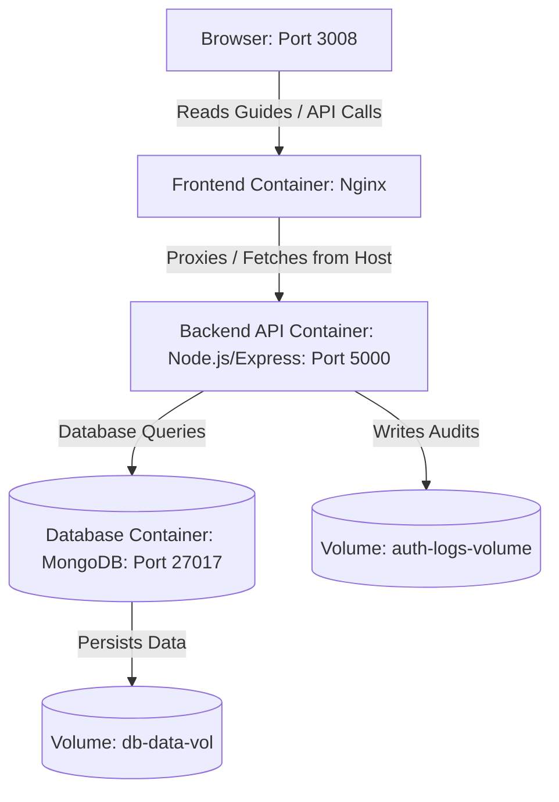

# MERN Stack Dockerized Reference System

A production-ready, three-tier MERN stack application demonstrating Docker containerization best practices, multi-stage builds, persistent storage mounting, and Docker Compose orchestration.

This system serves as a live documentation application where the frontend fetches and displays markdown containerization guides served by the backend API.

---

## 1. Project Architecture

The application is architected as a three-tier system:



### Core Technologies
* **Frontend**: React (Vite SPA) served by Nginx (Port 3008). Features runtime environment injections for API endpoints.
* **Backend**: Node.js & Express API (Port 5000) that parses dynamic environment variables, connects via Mongoose, writes activity logs, and serves documentation.
* **Database**: MongoDB 6.0 (Port 27018 on Host / 27017 internally) secured with root credentials and persistent volume storage.

---

## 2. Directory Structure

Below is the directory map of the project, separating source code from configuration and documentation guides:

```text
DockerProject/
├── backend/                   # Node.js/Express API service
│   ├── controllers/           # Request handlers (e.g. guide rendering, logs)
│   ├── routes/                # Express API endpoints
│   ├── .env.example           # Reference environment variables config
│   ├── Dockerfile             # Multi-stage production Node.js Dockerfile
│   ├── package.json
│   └── server.js              # Application entrypoint
├── database/                  # MongoDB specifications and models
│   ├── models/                # Mongoose database schemas
│   ├── Dockerfile             # Custom MongoDB Dockerfile with health checks
│   ├── README.md              # Seeding instructions
│   ├── migration_notes.md     # Indexes and schemas evolution guide
│   └── seed.js                # Database seeder (Node.js script)
├── docs/                      # Architectural & containerization guides (Markdown)
│   ├── backend-docker-guide.md
│   ├── backend.md
│   ├── database-docker-guide.md
│   ├── database.md
│   ├── docker-compose-guide.md
│   ├── frontend-docker-guide.md
│   └── frontend.md
├── frontend/                  # React (Vite SPA) frontend application
│   ├── src/                   # React app source code
│   ├── Dockerfile             # Multi-stage build (Node.js compilation -> Nginx runtime)
│   ├── entrypoint.sh          # Nginx entrypoint to inject VITE_API_URL dynamically
│   ├── nginx.conf             # Nginx server configuration (SPA routing support)
│   └── package.json
├── docker-compose.yml         # Master Docker Compose configuration file
└── README.md                  # Project root overview documentation
```

---

## 3. Prerequisite Environment Setup

Ensure you have the following installed on your host system:
* **Docker Engine** (v20.10+) or **Docker Desktop**
* **Docker Compose v2**
* **Git** (for version control)

---

## 4. Quick Start (Using Docker Compose)

You can spin up the entire three-tier architecture with a single command. 

### Step 4.1: Build and Run the Stack
Run the following command from the project root directory:
```bash
docker compose up -d --build
```
* **`-d`**: Runs all services in detached mode in the background.
* **`--build`**: Automatically rebuilds local images for the services (applying recent code changes).

### Step 4.2: Seed the Database
After the containers spin up and the database health check passes (approx. 10-15 seconds), execute the seeding script inside the running API container:
```bash
docker compose exec backend node /app/database/seed.js
```

### Step 4.3: Access the Application
* **Frontend UI**: Open your browser and navigate to `http://localhost:3008/` or `http://localhost:3008/guides`.
* **Backend API Health**: Verify the backend endpoint directly at `http://localhost:5000/api/guides/frontend`.

---

## 5. Summary of Tier Containerization & Configurations

### 5.1 Frontend Service
* **Strategy**: Multi-stage build.
  - **Stage 1 (Build)**: Compiles React assets using Node.js.
  - **Stage 2 (Runtime)**: Copies static files into a tiny Nginx image (~30MB), disabling Node.js dependencies in production.
* **Dynamic Configuration**: A custom Nginx entrypoint script (`entrypoint.sh`) writes environment variables into `/usr/share/nginx/html/config.js` at container boot, allowing you to configure the API endpoint at runtime without rebuilding the image.
* **Service Ports**: Maps host port `3008` to container Nginx port `80`.

### 5.2 Backend Service
* **Strategy**: Multi-stage build.
  - **Stage 1 (Dependencies)**: Resolves npm packages, caching layers for optimized rebuilds.
  - **Stage 2 (Runtime)**: Copies compiled runtime dependencies and drops user permissions to the non-root `node` user for security hardening.
* **Documents Directory**: Copies the `/docs` directory into `/app/docs` so that Markdown guides are available for server-side loading and rendering.
* **Service Ports**: Maps host port `5000` to container port `5000`.

### 5.3 Database Service
* **Strategy**: Custom MongoDB 6.0 build.
  - Adds customized tags/labels for metadata auditing.
  - Includes a dedicated `HEALTHCHECK` checking MongoDB readiness via `mongosh --eval 'db.runCommand("ping").ok'`.
* **Storage Persistence**: Maps container data directory `/data/db` to the Docker named volume `db-data-vol`.
* **Service Ports**: Maps host port `27018` to container MongoDB port `27017`.

---

## 6. Docker Compose Service Cheat Sheet

Run these commands from the project root folder:

| Command | Action |
|---------|--------|
| `docker compose up -d` | Start services in background |
| `docker compose up -d --build` | Re-build changed layers and restart services |
| `docker compose down` | Stop and remove active containers & networks |
| `docker compose down -v` | Stop containers and wipe volume data completely |
| `docker compose ps` | View container health statuses and ports |
| `docker compose logs -f` | Stream consolidated real-time logs |
| `docker compose logs -f backend` | Stream logs only for the backend container |
| `docker compose exec backend node /app/database/seed.js` | Run database seeder on-demand |
| `docker compose exec -it database mongosh -u dbadmin -p supersecurepassword --authenticationDatabase admin` | Log directly into MongoDB interactive shell |
